## 一个像网页版 Telegram 端到端加密聊天工具部署教程

NodeCrypt 是一个开源的 端到端加密（E2EE）网页聊天系统，最大特点是 加密和解密全部在浏览器端完成，服务器无法看到任何明文内容。服务器只负责转发密文，本身是“零知识”的。

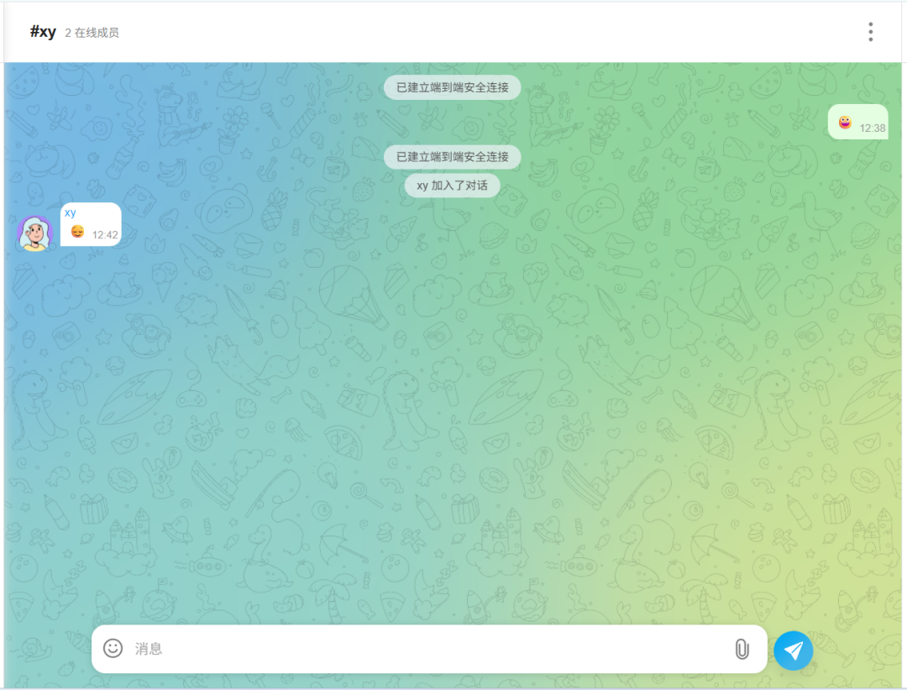

NodeCrypt 使用 WebSocket 实现实时通信，后端基于 Cloudflare Workers + Durable Objects，部署轻量，支持一键上线。

项目：
https://github.com/shuaiplus/NodeCrypt

它不要求注册账号，支持 匿名聊天，通过 房间 + 节点 的方式生成加密密钥，只有进入同一房间的用户才能解密消息。不保存聊天记录、不依赖数据库，消息是临时的。

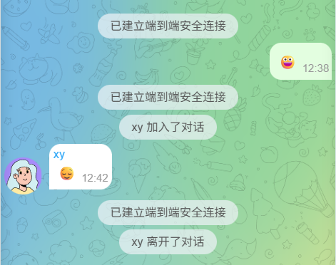

**部署**

1.下载项目

` git clone https://github.com/shuaiplus/NodeCrypt.git`

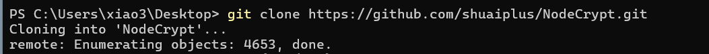

2.打开项目

`cd NodeCrypt`

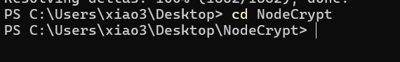

3.安装

`npm install`

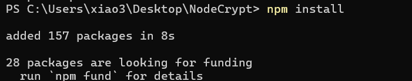

4.构建

`npm run build`

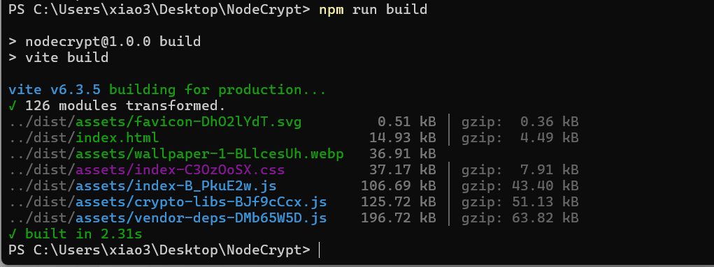

4.部署到cloudflare
`npm run deploy`

会自动部署到workers

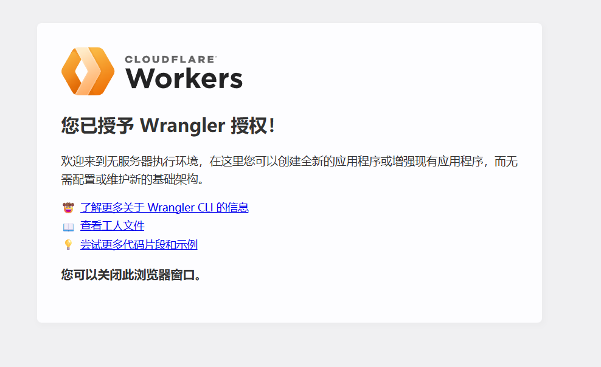

时间显示1分钟前就没问题

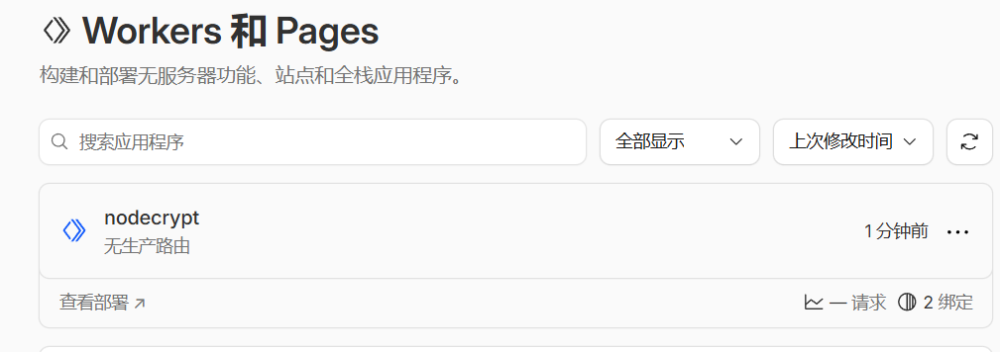

访问提供的域名进入聊天界面，先要求用户名和节点名称都是任意取

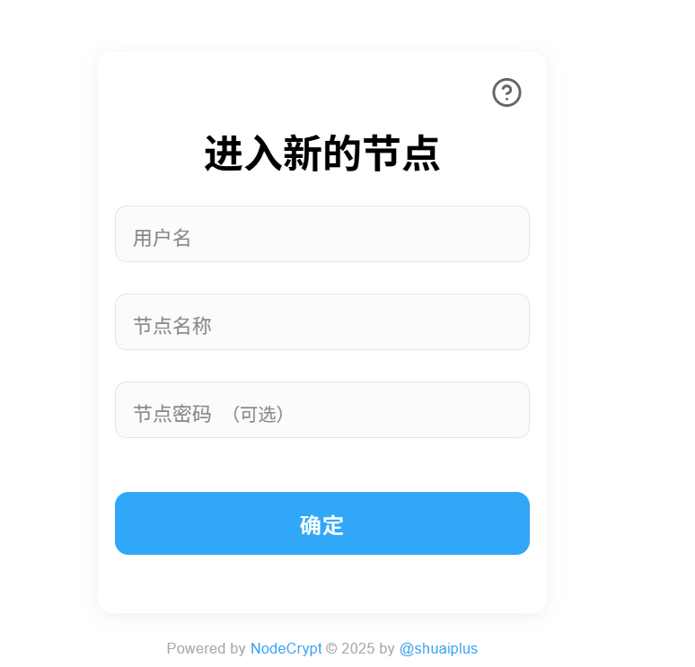

聊天界面像tg，很清爽

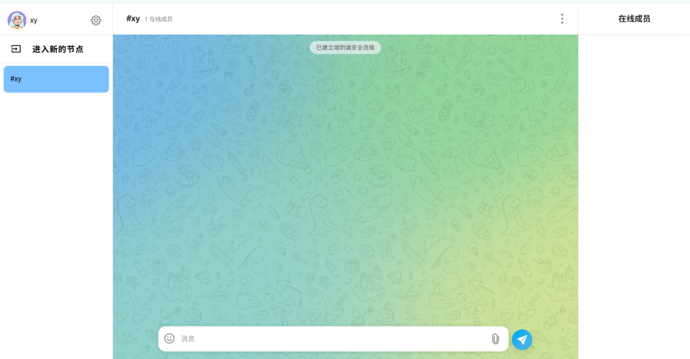

用 另一个浏览器，打开同一个 NodeCrypt 地址，输入同一个房间名 +节点，会看到在线成员变成 2

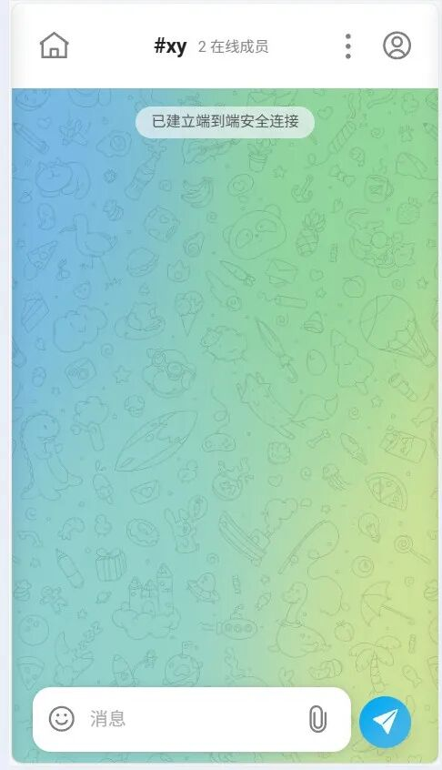

NodeCrypt 已成功建立端到端加密连接的聊天场景：两名用户进入同一节点后上线、收发消息，系统提示“已建立端到端安全连接”，并能看到成员加入与离开的状态变化，整体体验和 Telegram 网页版非常相似
